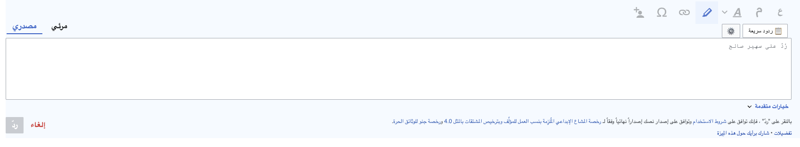
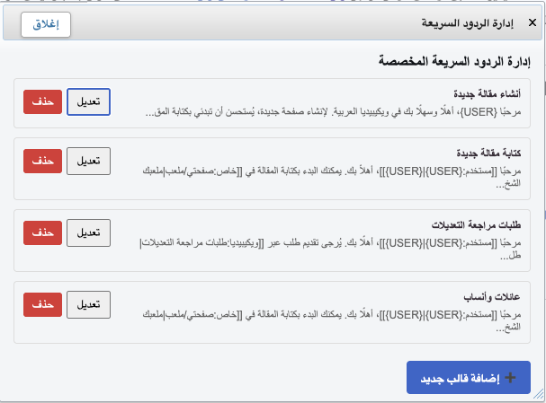

# Quick Replies (DiscussionTools)

A lightweight MediaWiki user script that adds **Quick Replies templates** to the **DiscussionTools reply toolbar**, letting you insert ready-made messages into the reply box in one click.

## Screenshots

Place your screenshots in `docs/screenshots/` (or change the paths below to match your repo).

- `docs/screenshots/toolbar.png`
- `docs/screenshots/picker.png`
- `docs/screenshots/manager.png`





## Features

- Adds a **Quick Replies** button inside the DiscussionTools reply toolbar.
- Inserts templates into the active reply editor reliably (VisualEditor wikitext + CodeMirror overlay).
- Built-in **Template Manager** (add / edit / delete).
- Stores custom templates on-wiki in a user JSON page.
- Supports the `{USER}` placeholder (auto-detects the user you’re replying to).

## Requirements

- DiscussionTools enabled (reply widgets).
- VisualEditor enabled for replies (wikitext mode).
- CodeMirror overlay recommended.

## Installation (User Script)

1. Create an on-wiki page and paste the production script:

- `User:YOUR_USERNAME/QuickReplies.js`

2. Load it from your `common.js`:

```js
mw.loader.load(
  mw.util.getUrl('User:YOUR_USERNAME/QuickReplies.js', {
    action: 'raw',
    ctype: 'text/javascript'
  })
);
```

3. Hard refresh (Ctrl+F5) and test:
- Open any talk page.
- Click **Reply**.
- You should see **Quick Replies** in the toolbar.

## Custom Templates Storage

Custom templates are stored in:

- `User:YOUR_USERNAME/QuickReplies.json`

The script reads this JSON page via the MediaWiki API and merges it with built-in defaults.

### JSON format

The JSON page must be an array of objects:

```json
[
  {
    "label": "Welcome",
    "text": "Hello [[User:{USER}|{USER}]], welcome to Wikipedia! ~~~~"
  },
  {
    "label": "Sources reminder",
    "text": "Hi [[User:{USER}|{USER}]], please add reliable sources for the added information. Thanks!"
  }
]
```

## Placeholders

### `{USER}`

`{USER}` is replaced with the username you are replying to (derived from the active reply widget context).

Example:

```wiki
مرحبًا [[مستخدم:{USER}|{USER}]]، شكرًا لمساهمتك. تحياتي. ~~~~
```

## Notes / Compatibility

- Designed specifically for DiscussionTools reply widgets.
- Insertion uses the VisualEditor model, so it works even when the underlying textarea is a dummy element.
- Some skins/gadgets may alter the reply widget DOM; adjust selectors if needed.

## Contributing

PRs and suggestions are welcome, especially for:
- Additional placeholders (e.g. `{SIGN}`, `{DATE}`)
- i18n / UI translations
- More robust widget/editor detection

## License

Copyright (c) [2026] [Maher]

Permission is hereby granted, free of charge, to any person obtaining a copy of this software and associated documentation files (the "Software"), to deal in the Software without restriction, including without limitation the rights to use, copy, modify, merge, publish, distribute, sublicense, and/or sell copies of the Software, and to permit persons to whom the Software is furnished to do so, subject to the following conditions:

The above copyright notice and this permission notice shall be included in all copies or substantial portions of the Software.

THE SOFTWARE IS PROVIDED "AS IS", WITHOUT WARRANTY OF ANY KIND, EXPRESS OR IMPLIED, INCLUDING BUT NOT LIMITED TO THE WARRANTIES OF MERCHANTABILITY, FITNESS FOR A PARTICULAR PURPOSE AND NONINFRINGEMENT. IN NO EVENT SHALL THE AUTHORS OR COPYRIGHT HOLDERS BE LIABLE FOR ANY CLAIM, DAMAGES OR OTHER LIABILITY, WHETHER IN AN ACTION OF CONTRACT, TORT OR OTHERWISE, ARISING FROM, OUT OF OR IN CONNECTION WITH THE SOFTWARE OR THE USE OR OTHER DEALINGS IN THE SOFTWARE.
